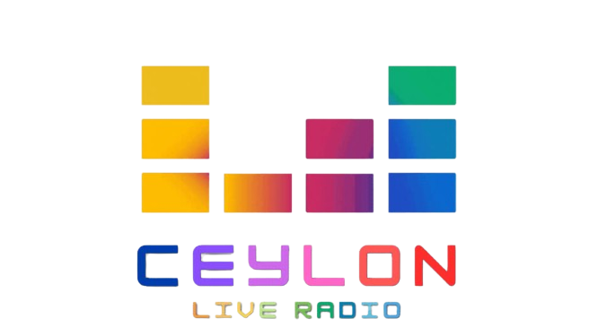

# Ceylon Live Radio Player



## Table of Contents

- [Description](#description)
- [Features](#features)
- [Demo](#demo)
- [Installation](#installation)
- [Usage](#usage)
- [Contributing](#contributing)
- [Credits](#credits)
- [License](#license)

## Description

The Live Radio Player is a web application that allows users to listen to a variety of radio channels online. With an intuitive user interface and easy navigation, users can effortlessly browse through different radio stations and start listening to their favorite shows and music.

## Features

- **Wide Selection:** Choose from a diverse range of radio channels covering various genres such as music, news, talk shows, and more.
- **Responsive Design:** The application is optimized for various devices, ensuring a seamless listening experience on desktops, tablets, and smartphones.
- **Easy Navigation:** The user interface is designed to be intuitive and user-friendly, making it easy for users to find and select their preferred radio stations.
- **Customizable Controls:** Users can adjust the volume, pause/play the audio stream, and mute/unmute the sound with convenient controls.
- **Instant Playback:** Start listening to your favorite radio stations instantly without any hassle.

## Demo

[Link to Live Demo](https://radio.ceylon.eu.org)

## Installation

To run the Live Radio Player locally on your machine, follow these steps:

1. Clone the repository:

    ```bash
    git clone https://github.com/your-username/Ceylon-Live-FM-Radio.git
    ```

2. Navigate to the project directory:

    ```bash
    cd Ceylon-Live-FM-Radio
    ```

3. Open the `index.html` file in your web browser.

## Usage

1. Select a radio channel by clicking on the corresponding button.
2. Use the playback controls to pause/play the audio stream and adjust the volume.
3. Enjoy listening to your favorite radio stations!

## Contributing

Contributions are welcome! If you'd like to contribute to this project, please follow these guidelines:

1. Fork the repository.
2. Create a new branch (`git checkout -b feature/your-feature`).
3. Make your changes and ensure they're properly tested.
4. Commit your changes (`git commit -m 'Add new feature'`).
5. Push to the branch (`git push origin feature/your-feature`).
6. Create a new Pull Request.

## Credits

- [Your Name](https://github.com/sh-y-zu) - Creator and maintainer of the Live Radio Player.

## License

This project is licensed under the [MIT License](LICENSE).
